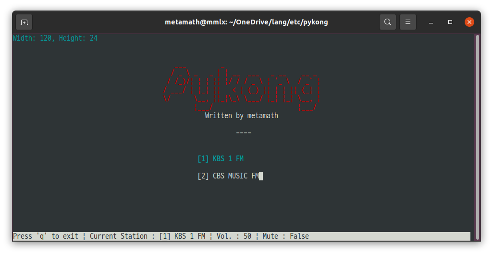

# pykong
Pykong is a simple KBS Classic FM streaming player using an external media player.

## Features
- Streaming KBS 1 FM(Classic FM) using personal routing service by eminat
- Add stations to config.json
- Select a stations with numeric keys. 

## ScreenShot


## Installation
By default, you need to have Python installed. If you have Python installed, run the following command. 
```sh
sudo apt install vlc
pip install python-vlc
python pykong.py
```
- On Ubuntu, You must install vlc player using `apt install`. Otherwise, you might get the following error.
```sh
AttributeError: 'NoneType' object has no attribute 'media_player_new'
```
- On Windows, download and install vlc player from the following address; https://www.videolan.org/vlc/index.html

### config.json
- The player key is deprecated because it uses a vlc instance internally. 
- Write the station's address and name on the number keys. 

```json
{
    "player":"C:/PROGRA~1/VideoLAN/VLC/vlc -vvv",
    "stations":{
	    "1": {"name": "[1] KBS CLASSIC FM", "url": "http://serpent0.duckdns.org:8088/kbsfm.pls"},
	    "2": {"name": "[2] CBS MUSIC FM", "url": "http://aac.cbs.co.kr/cbs939/_definst_/cbs939.stream/playlist.m3u8"}
    }
}
```

## Miscellaneous
- Special thanks for serving private streaming to eminat who is a member at Naver Cafe, 좌충우돌 오디오.  

## License
- MIT
